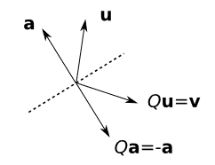
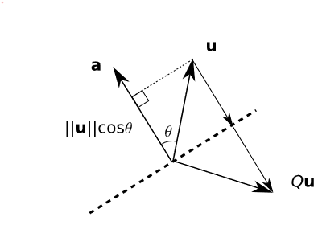
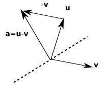

- Topic: Householder Transformations, Householder Reflections
- Last revised: 13.12.2022

---

# Introduction

Alston Householder, an American mathematician, introduced this transformation in a 1958 paper (Householder, 1958). Householder's procedure provides an efficient way to put a given matrix into upper-triangular form. It can be shown that the Gaussian elimination and Householder methods for upper-triangularization are on the order of $n^3$, which are far more efficient than naive cofactor expansion.

There are many other application of Householder transformation. A list of applications is

- Upper-triangularization,
- QR decomposition,
- Tridiagonalization,

and so on.

## Householder matrix (Householder reflector)

This transformation has a name "reflector". Where this name comes from? Consider a (reflection) matrix $Q$ that can reflect a vector $\boldsymbol{u}$ with respect to a hyperplane (dashed line) perpendicular to a vector $\boldsymbol{a}$.

*Fig 1: Geometric interpretation of reflection matrix $Q$*.

The vector $\boldsymbol{a}$ is a vector that is perpendicular to the hyperplane. We want to obtain such a matrix $Q$, which transforms $\boldsymbol{u}$ to $\boldsymbol{v}$.

How can we do this? It is simple. Consider $\boldsymbol{a}$ as a axis. We denote the projection vector of $\boldsymbol{u}$ on $\boldsymbol{a}$ as $\boldsymbol{u}_{\lVert\boldsymbol{a}}=\frac{\boldsymbol{a}}{\|\boldsymbol{a}\|}\|\boldsymbol{u}\|\cos\theta$. What we need to do is just subtract two times of the projection of $\boldsymbol{u}$ on $\boldsymbol{a}$ from $\boldsymbol{u}$.

*Fig 2: Reflect $\boldsymbol{u}$ by using the projection of $\boldsymbol{u}$ on $\boldsymbol{a}$.*

Then, we can formulate the equation

$$Q\boldsymbol{u}=\boldsymbol{u}-2\boldsymbol{u}_{\lVert\boldsymbol{a}}.$$

Recall that $<\boldsymbol{a},\boldsymbol{u}>=\|\boldsymbol{a}\|\|\boldsymbol{u}\|\cos\theta=\boldsymbol{a}^H\boldsymbol{u}$, $\|\boldsymbol{a}\|^2=<\boldsymbol{a},\boldsymbol{a}>=\boldsymbol{a}^T\boldsymbol{a}$ and $\|\boldsymbol{u}\|^2=<\boldsymbol{u},\boldsymbol{u}>=\boldsymbol{u}^H\boldsymbol{u}$. The projection vector can be rewritten as

$$\boldsymbol{u}_{\lVert\boldsymbol{a}}=\boldsymbol{a}\frac{\boldsymbol{a}^H\boldsymbol{u}}{\boldsymbol{a}^H\boldsymbol{a}}=\left(I-2\frac{\boldsymbol{a}\boldsymbol{a}^H}{\boldsymbol{a}^H\boldsymbol{a}}\right)\boldsymbol{u},$$

from which we have

$$Q=I-2\frac{\boldsymbol{a}\boldsymbol{a}^H}{\boldsymbol{a}^H\boldsymbol{a}}.\qquad (1)$$

## Find $\boldsymbol{a}$ given $\boldsymbol{u}$ and $\boldsymbol{v}$

If we have a vector $\boldsymbol{u}$ and its reflection $\boldsymbol{v}$, how can we find the axis of reflection $\boldsymbol{a}$? We know that from the algebra we have $\boldsymbol{a}=\boldsymbol{u}-\boldsymbol{v}$.

*Fig 3: Find $\boldsymbol{a}$ given $\boldsymbol{u}$ and $\boldsymbol{v}$.*

We can check this by

$$\begin{aligned}
   Q\boldsymbol{a}=&Q(\boldsymbol{u}-\boldsymbol{v})\\
   =&Q\boldsymbol{u}-Q\boldsymbol{v}\\
   =&\boldsymbol{v}-\boldsymbol{u}\\
   =&-\boldsymbol{a}. 
\end{aligned}$$

## Properties of $Q$

- Orthogonality / Unitarily: $Q^TQ=I$ if $Q$ is real. $Q^HQ=I$ if $Q is complex.
- Symmetric / Hermitian: $Q=Q^T$ if $Q$ is real. $Q^H=Q$ if $Q$ is complex.
- Involutory: From the orthogonality and symmetric, $Q=Q^{-1}$. Thus, $Q^2=I$.
- Norm preserving since $Q$ is orthogonal/unitary, i.e., $\|\boldsymbol{v}\|=\|\boldsymbol{u}\|$.

# Example: Upper-triangularization

In the following, we focus on describing the procedure in the real-number space. The upper triangularization is to put a matrix to a special form where the entries below diagonal are zero. The usual procedure to upper triangularize a matrix is to first change the first column into one which only the first entry is nonzero, then change the second one into one which only the first two entries are nonzero, and so on. As a conclusion, Householder's idea is to apply a succession of orthogonal matrices $Q_k\in\mathbb{R}^{m\times m}$ to $C$ to compute upper triangular matrix $D$

$$Q_n\cdots Q_2Q_1C=D.$$

By the way, for a full QR decomposition $A=QR$, we can apply Householder method and finally let $Q=Q_1^TQ_2^T\cdots Q_n^T$.

In 1958, Householder proposed a way to choose $Q_k$ to remove the nonzero entries below the diagonal column by column while preserving previous zeros. The $Q_k$ should have a structure as

$$Q_k=\begin{bmatrix}I&0\\
0&F\end{bmatrix},$$

where $I\in\mathbb{R}^{(k-1)\times(k-1)}$ and $F\in\mathbb{R}^{(m-k+1)\times(m-k+1)}$ is the *Householder reflector*. The identity block matrix $I$ ensures the first $k-1$ rows are unchanged. Also, the identity block helps preserve the orthogonality of $Q_k$. Since $F$ is an orthogonal matrix, $Q_k$ is thus an orthogonal matrix as well. 

Take a $3\times5$ matrix $C$ as an example,

$$C=\begin{bmatrix}
\ast & \ast & \ast & \ast & \ast\\
\ast & \ast & \ast & \ast & \ast\\
\ast & \ast & \ast & \ast & \ast
\end{bmatrix}=[\boldsymbol{c}_1,\boldsymbol{c}_2,\boldsymbol{c}_3,\boldsymbol{c}_4,\boldsymbol{c}_5].$$

After upper triangularization,

$$D=QC=\begin{bmatrix}
\ast & \ast & \ast & \ast & \ast \\
0 & \ast & \ast & \ast & \ast\\
0 & 0 & \ast & \ast & \ast
\end{bmatrix}=[\boldsymbol{d}_1,\boldsymbol{d}_2,\boldsymbol{d}_3,\boldsymbol{d}_4,\boldsymbol{d}_5].$$

For the first step to transform $\boldsymbol{c}_{1}$ to $\boldsymbol{d}_{1}$, we have $\boldsymbol{d}_{1}=Q_1\boldsymbol{c}_{1}$. We need to determine first $\boldsymbol{d}_1=[d_{11},0,0]^T$. As we know, the Householder transformation preserves the norm. indicating that $d_{11}=\|\boldsymbol{c}_1\|$. The axis $\boldsymbol{a}^{(1)}=\boldsymbol{c}_1-\boldsymbol{d}_1$. Then $Q_1$ can be calculated as Equation (1).

Now we have $D^{(1)}=Q_1C$, the first column of which has zero entries except for the first one

$$D^{(1)}=\begin{bmatrix}
\begin{array}{c|cccc}
\ast & \ast & \ast & \ast& \ast \\
\hline
0 & \ast & \ast & \ast & \ast\\
0 & \ast & \ast & \ast & \ast
\end{array}\end{bmatrix}.$$

The second step is on the remaining $2\times4$ block matrix by omitting the top row and left column, denoted as $S^{(1)}=\left[\boldsymbol{s}_1^{(1)},\boldsymbol{s}_2^{(1)},\boldsymbol{s}_3^{(1)},\boldsymbol{s}_4^{(1)}\right]^T$. The second Householder reflector is

$$Q_2=\begin{bmatrix}
   1 & 0\\
   0&F_2 
\end{bmatrix},$$

making $D^{(2)}=F_2S^{(1)}$, where $D^{(2)}=\left[\boldsymbol{d}_1^{(2)},\boldsymbol{d}_2^{(2)},\boldsymbol{d}_3^{(2)},\boldsymbol{d}_4^{(2)}\right]$. The first column of $D^{(2)}$ should have nonzero value only on the first entry after Householder transformation $\boldsymbol{d}_1^{(2)}=F_2\boldsymbol{s}^{(1)}_1$. Similarly, with $\boldsymbol{d}^{(2)}_1=\left[d_{11}^{(2)},0\right]^T$, by setting $d_{11}^{(2)}=\left\|\boldsymbol{s}_1^{(1)}\right\|$, the axis of projection is $\boldsymbol{a}^{(2)}=\boldsymbol{s}_1^{(1)}-\boldsymbol{d}_1^{(2)}$, we can calculate $F_2$ by Equation (1).

This procedure is done after the last one column is processed.

## Notes

In practice, it's important to choose the "better of the two reflectors". Take the first Householder transformation as an example. The fact that we have two choices on $\boldsymbol{d}_1$ in formulating the Householder reflector is from that $d_{11}$ can be $\pm\|\boldsymbol{c}_1\|$. To avoid the cancellation error which can happen when we subtract two nearly equal numbers, we can choose $d_{11}$ to have the opposite sign of $c_{11}$, i.e.

$$d_{11}=-\textbf{sign}(c_{11})\|\boldsymbol{c}_1\|,$$

and then $\boldsymbol{a}=\left[-\textbf{sign}(c_{11})\|\boldsymbol{c}_1\|,0,0\right]^T-\boldsymbol{c}_1$.

Since the sign of $\boldsymbol{a}$ doesn't affect $Q_1$, we can scale $\boldsymbol{a}$ by $-1$

$$\boldsymbol{a}=\left[\textbf{sign}(c_{11})\|\boldsymbol{c}_1\|,0,0\right]^T+\boldsymbol{c}_1.$$

# Comparison with Gram-Schmidt Orthogonalization Procedure

The Householder algorithm is more numerically stable and more efficient than Gram-Schmidt. But Gram-Schmidt allows us to build up orthogonal basis for successive spaces spanned by columns, which can be important in some cases.

# References

- Householder, A. S. (1958). "Unitary Triangularization of a Nonsymmetric Matrix". Journal of the ACM. 5(4): 339-342. doi:10.1145/320941.320947. MR 0111128. S2CID 9858625